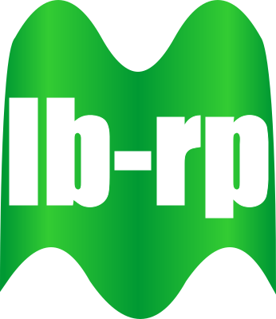

# scripts
Common scripts used by mong projects

## Suggesting logos
Below is a set of logos that we might want to use for our mong(r) projects. Feel free to add more columns of logo themes :-)

|Project|Logo|
|:---|---:|
|qmongr||
|tmongr||
|imongr||
|db||
|lb-rp||
|qmongrdata||
|shinyproxy||
|mongr||

